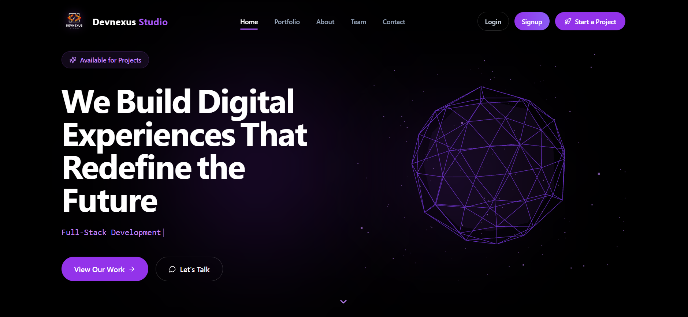

<div align="center">
  <h1 style="font-size: 3.5rem; font-weight: 800; margin-bottom: 8px; display: inline-flex; align-items: center; gap: 12px;">
    
    <span>Devnexus Studio</span>
  </h1>
  
  <p>
    <strong>The official web platform and client portal of Devnexus Studio</strong>
  </p>

  <p>
    <i>Crafting reliable, high-performance web platforms with built-in security and a seamless user experience.</i>
  </p>

  <br/>

  <div>
    
    
    
    
  </div>

  <br/>

  <a href="https://devnexus-studio.vercel.app/" target="_blank">
    
  </a>

  <br/>
  <br/>

  <p>
    <a href="#installation--setup"><b>🚀 Get Started</b></a> &nbsp;&nbsp;•&nbsp;&nbsp;
    <a href="#architecture--system-flow"><b>🏗️ System Architecture</b></a> &nbsp;&nbsp;•&nbsp;&nbsp;
    <a href="#security-highlights"><b>🛡️ Security Protocol</b></a> &nbsp;&nbsp;•&nbsp;&nbsp;
    <a href="https://github.com/Krishna-Pratik/devnexus-studio/issues"><b>🐛 Report Bug</b></a>
  </p>
</div>

---

## 📑 Table of Contents
- [Project Overview](#project-overview)
- [Why Choose Devnexus?](#why-choose-devnexus)
- [Tech Stack](#tech-stack)
- [Core Features](#core-features)
- [Architecture & System Flow](#architecture--system-flow)
- [Security Highlights](#security-highlights)
- [Screenshots](#screenshots)
- [Installation & Setup](#installation--setup)
- [Environment Variables](#environment-variables)
- [Folder Structure](#folder-structure)
- [Deployment](#deployment)
- [Future Improvements](#future-improvements)
- [Author](#author)
- [License](#license)

---

## 📖 Project Overview

**Devnexus Studio** is our official agency portfolio and client management platform, engineered for both an exceptional user experience and robust security. By decoupling a highly interactive frontend from a secure Express backend API, it delivers a scalable foundation to showcase our digital craftsmanship, capture leads, and seamlessly interact with our clients.

## 🌐 Live Demo

[](https://devnexus-studio.vercel.app/)

## 💼 Why Choose Devnexus?

Devnexus Studio is our proprietary digital solution designed to help businesses elevate their online presence while providing our clients with a streamlined, secure workflow.

- 🎨 **Polished Digital Experiences:** Tailored portfolios and dynamic landing pages designed to clearly and professionally showcase your brand's value.
- 🛡️ **Built-In Protection:** Industry-standard validation, authentication, and secure session management to keep client data and communications safe.
- 📈 **Scalable Architecture:** A flexible, cloud-ready foundation designed to easily adapt and scale as your business grows.
- ⚡ **Optimized Performance:** Lightweight builds and buttery-smooth interactions that ensure high user retention and strong SEO performance.
- 🤝 **Streamlined Client Workflows:** Centralized lead generation, automated meeting scheduling via Calendly, direct messaging, and activity tracking straight from an intuitive dashboard.

## 💻 Tech Stack

### 🎨 Frontend


### ⚙️ Backend


### 🛠️ DevOps & Tools


## ✨ Core Features

### 🏢 Client Portal Features
- 📅 **Automated Meeting Scheduling:** Seamless native Calendly integration allowing clients to book consultations and project reviews instantly.
- 📊 **Real-Time Project Tracking:** Dynamic progress bars and milestone tracking to keep clients fully updated at every stage of development.
- 💬 **Integrated Messaging System:** A native-feeling, auto-scrolling chat interface for seamless, direct client-to-agency communication.
- ⏳ **Interactive Activity Timeline:** A chronological, color-coded feed of recent events, project updates, and completed milestones.
- 💳 **Payment & Invoice Tracking:** Dedicated dashboard views for clients to easily monitor pending invoices and processed payments.
- 🎨 **Bespoke Portfolio Presentation:** High-performance, visually stunning project showcases with buttery-smooth animations.

### 🛠️ Technical Capabilities
-  **Secure Authentication:** Robust local signup/login backed by seamless Google OAuth integration.
- 🔄 **State & Session Persistence:** Protected routes utilizing auto-restoring user states and secure `httpOnly` cookies.
- 🛑 **Reliable API Handling:** Centralized schema validation (`Zod`) guaranteeing consistent data integrity and standardized error reporting.
- ⚡ **Optimized UX/UI:** Accessible interfaces built with global loading skeletons, responsive grid layouts, and comprehensive error recovery.

## 🏗 Architecture & System Flow

Devnexus Studio separates the `frontend` and `backend` codebases. This keeps the app easier to maintain and deploy:

| Architectural Benefit | Description |
| :--- | :--- |
| 📈 **Scalability** | Frontend and backend can be deployed separately when needed. |
| 🧩 **Maintainability** | Clear boundaries make the codebase easier to work on. |
| ⚡ **Performance** | Vite powers the frontend build, and Express handles the backend API. |

### 🔄 Frontend-Backend Interaction Flow
1. **Client Action:** A user interacts with the React UI (e.g., submitting a contact form or logging in).
2. **API Request:** An asynchronous request is dispatched to the backend Express microservice.
3. **Security Interception:** The request hits backend middlewares, including CORS, rate limiting, and Helmet headers.
4. **Rigorous Validation:** `Zod` schemas validate and sanitize the incoming payload.
5. **Business Logic & Persistence:** Validated data is processed by the controllers and securely stored in MongoDB.
6. **Session Delivery:** Upon authentication, a JWT is generated and attached as an `httpOnly`, `secure` cookie.
7. **UI State Update:** The frontend context seamlessly updates the user's dashboard based on the secure server response.

## 🛡️ Security Highlights

Security and data integrity are foundational to this application's architecture:

> **Cookie-Based Auth:** JWTs are strictly stored in `httpOnly` cookies, mitigating common XSS vulnerabilities.<br>
> **Centralized Validation:** `Zod` rigorously validates and sanitizes all API payloads before they reach business logic.<br>
> **Rate Limiting:** Sensitive endpoints (e.g., login, signup) are protected against brute-force attempts.<br>
> **Helmet Integration:** Standard secure HTTP headers are automatically applied to API responses.<br>
> **Strict CORS Policies:** API access is explicitly restricted to trusted frontend origins.<br>
> **Proxy-Aware HTTPS:** The server correctly enforces and handles secure connections in cloud environments.

## 📸 Screenshots

<div align="center">
  
  <br/>
  <i>Home hero section preview</i>
</div>

## 🚀 Installation & Setup

### 1. Clone the repository
```bash
git clone https://github.com/Krishna-Pratik/devnexus-studio.git
cd devnexus-studio
```

### 2. Install Dependencies
Install packages for both frontend and backend environments:
```bash
# Install backend dependencies
cd backend
npm install

# Install frontend dependencies
cd ../frontend
npm install
```

### 3. Setup Environment Variables
Create a `.env` file in both the `frontend` and `backend` directories using the reference below.

### 4. Run Locally
```bash
# Run Backend (from /backend)
npm run dev

# Run Frontend (from /frontend)
npm run dev
```

## 🔐 Environment Variables

### Backend (`backend/.env`)
| Variable | Description |
| --- | --- |
| `PORT` | Backend server port (e.g., 5000) |
| `MONGO_URI` | MongoDB connection string |
| `JWT_SECRET` | Secret key for signing JWTs |
| `CLIENT_URL` | Frontend URL for CORS (e.g., http://localhost:5173) |
| `GOOGLE_CLIENT_ID` | OAuth Client ID from Google Cloud Console |

### Frontend (`frontend/.env`)
| Variable | Description |
| --- | --- |
| `VITE_API_URL` | Backend API URL (e.g., http://localhost:5000/api) |
| `VITE_GOOGLE_CLIENT_ID` | OAuth Client ID for frontend Google provider |

## 📁 Folder Structure

```text
devnexus-studio/
├── backend/               # Node.js / Express API
│   ├── controllers/       # Route logic
│   ├── middlewares/       # Security, Auth, Rate Limiting
│   ├── models/            # Mongoose schemas
│   ├── routes/            # API endpoints
│   ├── utils/             # Helpers & Zod schemas
│   └── server.js          # Entry point
└── frontend/              # React / Vite Application
    ├── src/
    │   ├── components/    # Reusable UI & shadcn components
    │   ├── pages/         # Page layouts (Dashboard, Home, etc.)
    │   ├── contexts/      # React Context (Auth state)
    │   ├── lib/           # Utility functions
    │   └── App.tsx        # Main application routing
    └── package.json
```

## ☁️ Deployment

This application is designed for seamless modern cloud deployment:
- **Frontend:** Optimized for **Vercel**. Simply connect the repository, set the root directory to `frontend`, and configure build settings (`npm run build`).
- **Backend:** Ready for **Render**. Set the root directory to `backend`, configure environment variables, and use `npm start` (which should run `node server.js`).

## 🔮 Future Improvements

- [ ] Implement WebSockets for real-time notifications.
- [ ] Add CMS capabilities for dynamic portfolio updates.
- [ ] Integrate Redis for session caching and optimized rate-limiting.
- [ ] Comprehensive unit and integration testing (Jest/Cypress).

## 👨‍💻 Author

**Krishna Pratik**
- GitHub: [@Krishna-Pratik](https://github.com/Krishna-Pratik)
- LinkedIn: [Krishna Pratik](https://www.linkedin.com/in/krishna-pratik)

---

## 📄 License

**STRICTLY PROPRIETARY AND CONFIDENTIAL**

Copyright © Devnexus Studio & Krishna Pratik. All Rights Reserved.

This repository, including all source code, assets, architecture, and documentation, is the exclusive intellectual property of Devnexus Studio.

**UNDER NO CIRCUMSTANCES IS ANYONE AUTHORIZED TO:**
- Copy, clone, or duplicate any portion of this codebase.
- Distribute, publish, or share this code, either publicly or privately.
- Modify, adapt, or create derivative works based on this project.
- Use this code or its architecture for any commercial or non-commercial purposes.
- Reverse-engineer, decompile, or extract any core logic or proprietary systems.

This software is provided "AS IS" without warranty of any kind. Any unauthorized use, reproduction, or infringement of these terms will be met with immediate strict legal action.
